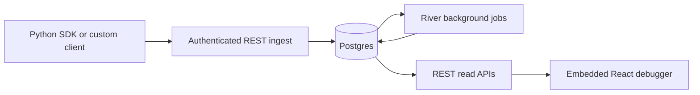

<p align="center">
  
</p>

<div align="center">

  # Continua

  **Self-hosted durable execution engine with built-in observability for AI agent runs.**

  <p>
    <a href="#quickstart"><b>Quickstart</b></a> ·
    <a href="#why-continua"><b>Why</b></a> ·
    <a href="#features"><b>Features</b></a> ·
    <a href="#architecture"><b>Architecture</b></a> ·
    <a href="#python-sdk"><b>Python SDK</b></a> ·
    <a href="https://www.continua.in/docs"><b>Docs</b></a> ·
    <a href="https://github.com/aryanVijaywargia/Continua/issues"><b>Issues</b></a>
  </p>

  <p>
    <a href="./LICENSE"></a>
    
    
    <a href="https://www.continua.in/docs"></a>
  </p>

</div>

---

Continua is a self-hosted **durable execution engine for AI agents, with built-in observability**. It runs agent workflows durably: they survive restarts and crashes through event-sourced history and replay, with activities, retries, timers, signals, and child workflows; and it captures every run as traces, spans, sessions, and events you inspect in an embedded React debugger. One Go binary plus Postgres, on your own infrastructure.

Two pillars, one binary. The **observability** path (REST ingest, Postgres storage, read APIs, the failure-first debugger, and the Python SDK) is production-shaped: trace runs, inspect spans and payloads, compare session attempts, and keep enough durable state to understand why an agent failed, stalled, retried, or diverged. The **durable engine** runs Go-defined workflows end-to-end today (preview); see the [roadmap & status](./docs-site/roadmap.mdx) for exactly what's shippable versus preview.

> [!NOTE]
> Public demo mode uses seeded sample traces only. Use the private local console path when you want to ingest and inspect your own traces.

<p align="center">
  
</p>

## Quickstart

The recommended first run is Docker Compose. It does not require local Go, Node, pnpm, Python, or uv.

```bash
git clone https://github.com/aryanVijaywargia/Continua.git
cd continua
make demo
```

Open:

```text
http://localhost:8080
```

Check the server:

```bash
curl http://localhost:8080/api/health
```

Useful demo commands:

```bash
make docker-logs      # follow service logs
make reset-demo       # reset demo data and reseed
make docker-down      # stop the Docker stack
```

`make demo` builds the Continua image, starts Postgres, runs migrations, starts the Go server with the embedded web UI, and seeds deterministic sample traces and sessions.

## Why Continua

Agent failures are rarely a single log line. The useful context is usually spread across model calls, tool calls, retries, state changes, branch decisions, and session-level attempts. Continua gives that context a durable home and a debugger built for investigation, not just dashboards.

It's most useful when you need to answer: what failed first, what changed during the run, why a particular branch was taken, how two attempts differed, and whether an ingest batch has been processed yet.

## Features


- **Durable execution engine (preview)**: run Go-defined agent workflows that survive restarts and crashes: event-sourced history + replay, activities with retries/backoff, timers, signals, child workflows, cancellation, and continue-as-new. Driven by the `continua-engine` worker runtime and projected into the debugger. See [Roadmap](./docs-site/roadmap.mdx) for preview scope.
- **Trace debugger**: span tree, execution waterfall, selected spans, payload inspection, breadcrumbs, truncation banners, and merged timeline events.
- **Session workflows**: browse sessions, open session detail, read the experimental narrative summary, and compare baseline vs. candidate traces from the same workflow.
- **Durable ingest path**: project-scoped API key auth, idempotent batches via `batch_key`, sync ingest, opt-in async ingest (`X-Continua-Async-Version: 2`), and batch polling.
- **Background processing**: River workers handle async ingest, trace rollups, and payload cleanup.
- **Embedded operator console**: the Vite React app is built into `internal/web/static/` and served by the Go binary. Includes a `⌘K` command palette, dark/light/system theming, and URL-driven filter state.
- **Project & operator auth**: first-class `POST /api/projects` with rotate/delete/list endpoints, plus optional Auth0 operator login gated by an email allow-list (see [Auth0 setup](./docs-site/guides/auth0-setup.mdx)).
- **Engine runs console**: `/engine/runs` lists durable engine runs, surfaces pending activity and inbox work, and exposes signal / suspend / resume / cancel / terminate against the engine control endpoints (preview).
- **Python SDK**: `trace`, `span`, `session`, `event`, batching, retries, and async polling live under `sdks/python`. SDK also exports engine-control helpers for the preview engine surface; see [Roadmap](./docs-site/roadmap.mdx) before relying on them in production.
- **Typed events**: Continua emits 11 event kinds (`log`, `error`, `exception`, `message`, `metric`, `custom`, `state_change`, `decision`, `effect`, `wait`, `snapshot_marker`); see the [events concept guide](./docs-site/concepts/events.mdx).


## Architecture




A request hits the authenticated ingest API, gets validated and batched (sync or async), and lands in Postgres. River workers process async batches, compute rollups, and run cleanup. The debugger reads everything back through REST and polls `GET /api/traces/{id}/events` for live trace detail. There is no live WebSocket runtime in the current checkout.

Alongside the platform server, the **`continua-engine` worker runtime** executes durable workflows: it claims runs, drives activities / timers / signals, and replays event-sourced history to recover across restarts, then projects run state back into the same Postgres so the debugger's engine-runs console can read it. Workflow execution is preview: Go-defined workflows, with the public `/v1/engine/*` control plane gated behind a preview flag. See the [engine concept guide](./docs-site/concepts/engine-foundation.mdx).


Stack: Go 1.24+ (Chi, Fx), PostgreSQL 16+ (sqlc), River for jobs, Vite/React/TypeScript with TanStack Query for the UI, OpenAPI 3 contracts driving generated Go/TS/Python types.


External IDs (`trace_id`, `span_id`, `parent_span_id`) are the SDK-facing identifiers; timeline responses merge stored events with synthetic span lifecycle markers.

See the [architecture overview](./docs-site/concepts/overview.mdx) for the full storage model and ingest flow.

## Python SDK

Install:

```bash
pip install continua-sdk
```

Create a trace:

```python
from continua import Continua, span, trace

Continua.init(
    api_key="default",
    endpoint="http://localhost:8080",
    ingest_mode="server_default",  # or "sync", "async_v2"
)


@trace(name="agent-run")
def run() -> None:
    with span("plan") as s:
        s.set_input({"goal": "summarize doc"})
        s.set_output({"plan": ["read", "summarize"]})


run()
```

> [!IMPORTANT]
> True async ingest is not read-after-write. If your code reads ingested data immediately after writing it, use `ingest_mode="sync"` or call `client.wait_for_batch(batch_id)` before reading.

See [`sdks/python/README.md`](./sdks/python/README.md) for SDK-specific usage and development commands.

## REST API

The full REST contract lives in [`contracts/openapi/openapi.yaml`](./contracts/openapi/openapi.yaml). All protected routes require a project-scoped API key; the 5 MB request-body cap applies to `/v1/ingest`.

## Configuration & development

The platform server is configured via environment variables read by [`internal/config/config.go`](./internal/config/config.go). `DATABASE_URL` is required. See the [installation guide](./docs-site/guides/installation.mdx) for the full list, the native development path (Go / React / SDK), and operational tunables. Note: `config.example.yaml` is not the live runtime contract.

After changing OpenAPI, sqlc queries, WebSocket schemas, or migrations that affect generated types, run `make generate`.

## Roadmap

Continua is in alpha. The authoritative status breakdown of what's shippable, what's preview, and what's coming next lives at [`docs-site/roadmap.mdx`](./docs-site/roadmap.mdx).

Shippable today: authenticated REST ingest, Postgres persistence, River background jobs, trace/session/timeline/compare read APIs, the embedded React debugger (incl. engine runs console), project & API-key management, Auth0 operator login, and the Python SDK.

Preview: durable engine workflow execution: the `continua-engine` worker runtime runs Go-defined workflows end-to-end with crash-recovery (event-sourced history + replay, activities, timers, signals, child workflows), but the public `/v1/engine/*` REST control plane is preview-gated, authoring is Go-only, and there's no production path for registering arbitrary workflow definitions yet.

Scaffolded (don't rely on yet): live WebSocket runtime, proxy capture, replay execution, full TypeScript SDK.

## Documentation

The full documentation site lives under [`docs-site/`](./docs-site/) (Mintlify) and is organised into six tabs:

- **Guides**: quickstart, [instrument your app](./docs-site/guides/instrument-your-app.mdx), [installation](./docs-site/guides/installation.mdx), [self-hosting](./docs-site/guides/self-hosting.mdx), [Auth0 setup](./docs-site/guides/auth0-setup.mdx), [managing projects](./docs-site/guides/managing-projects.mdx), and failure-debugging workflows.
- **Concepts**: [architecture overview](./docs-site/concepts/overview.mdx), [data model](./docs-site/concepts/data-model.mdx), [traces / spans / sessions](./docs-site/concepts/traces-spans-sessions.mdx), [events](./docs-site/concepts/events.mdx), [ingest lifecycle](./docs-site/concepts/ingest-lifecycle.mdx), [cost & tokens](./docs-site/concepts/cost-and-tokens.mdx), [projects & auth](./docs-site/concepts/projects-and-auth.mdx), [engine foundation](./docs-site/concepts/engine-foundation.mdx).
- **Debugger**: [tour of the UI](./docs-site/debugger/overview.mdx) plus per-page references for traces, trace detail, sessions, session compare, engine runs, command palette, and settings.
- **Python SDK**: [overview](./docs-site/sdk/python/overview.mdx), tracing, sessions, span events, batching & ingest modes, exceptions.
- **API Reference**: [auth & headers](./docs-site/api-reference/auth-and-headers.mdx) intro plus the auto-rendered OpenAPI playground.
- **Roadmap**: [shippable, preview, and scaffolded status](./docs-site/roadmap.mdx).

Related: [`engine/README.md`](./engine/README.md) for the engine binary's CLI commands, and [`sdks/python/README.md`](./sdks/python/README.md) for SDK-local development.

## Contributing

See [`CONTRIBUTING.md`](./CONTRIBUTING.md). The short version:

```bash
make generate
make lint
make test
```

Documentation in [`docs-site/`](./docs-site/) is authoritative for the public docs surface alongside the source tree.

## License

Continua is released under the [MIT License](./LICENSE).

---

<sub>Made with Go · Chi · Fx · Postgres · River · sqlc · React · Vite · TanStack Query · OpenAPI.</sub>
