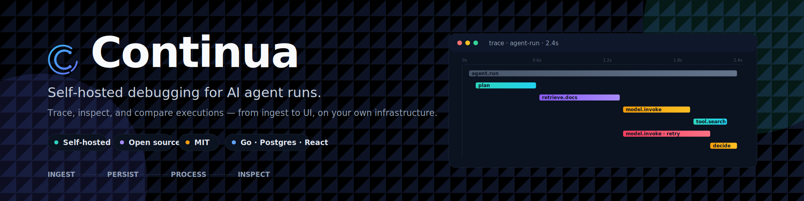
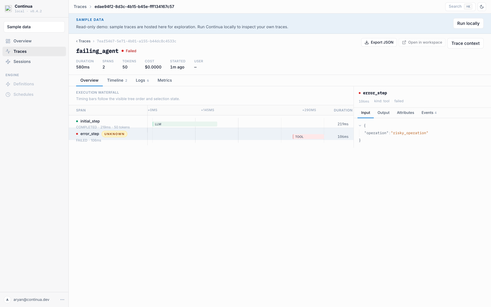
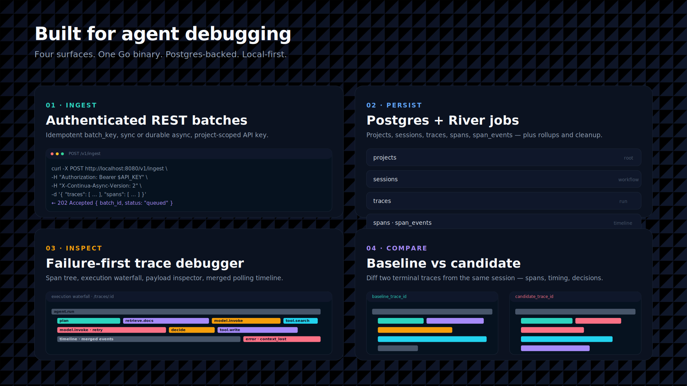
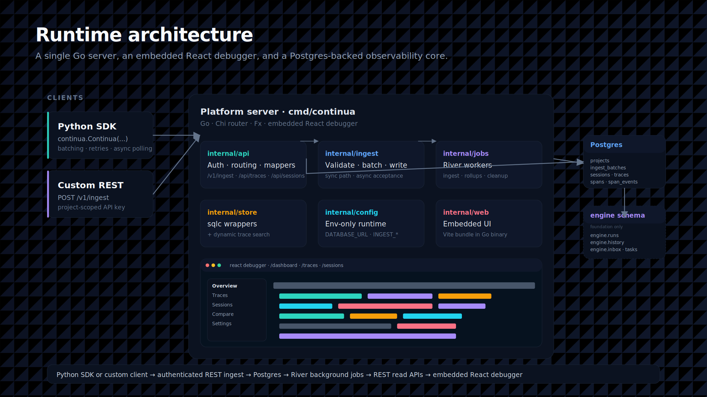
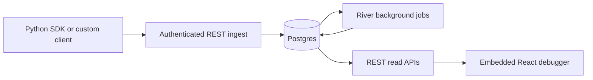
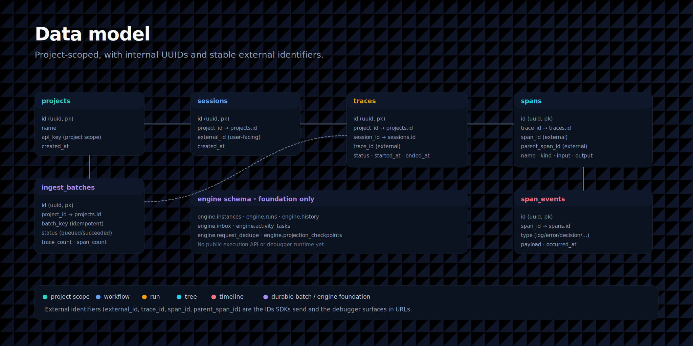

<p align="center">
  
</p>

<div align="center">

  # Continua

  **Self-hosted debugging for AI agent runs.**

  <p>
    <a href="#quickstart"><b>Quickstart</b></a> ·
    <a href="#why-continua"><b>Why</b></a> ·
    <a href="#features"><b>Features</b></a> ·
    <a href="#architecture"><b>Architecture</b></a> ·
    <a href="#python-sdk"><b>Python SDK</b></a> ·
    <a href="./docs/setup.md"><b>Docs</b></a> ·
    <a href="https://github.com/aryanVijaywargia/Continua/issues"><b>Issues</b></a>
  </p>

  <p>
    <a href="./LICENSE"></a>
    
    
  </p>

</div>

---

Continua is a **local operator console for debugging AI agent executions**. It accepts traces over an authenticated REST ingest API, persists them in Postgres, processes async work with River, and serves a React debugger from the Go backend — in a single binary, on your own infrastructure.

The current product is intentionally concrete: trace runs, inspect spans and payloads, compare session attempts, and keep enough durable state to understand why an agent failed, stalled, retried, or behaved differently than expected.

> [!NOTE]
> Public demo mode uses seeded sample traces only. Use the private local console path when you want to ingest and inspect your own traces.

<p align="center">
  
</p>

## Quickstart

The recommended first run is Docker Compose. It does not require local Go, Node, pnpm, Python, or uv.

```bash
git clone https://github.com/aryanVijaywargia/Continua.git
cd continua
make demo
```

Open:

```text
http://localhost:8080
```

Check the server:

```bash
curl http://localhost:8080/api/health
```

Useful demo commands:

```bash
make docker-logs      # follow service logs
make reset-demo       # reset demo data and reseed
make docker-down      # stop the Docker stack
```

`make demo` builds the Continua image, starts Postgres, runs migrations, starts the Go server with the embedded web UI, and seeds deterministic sample traces and sessions.

## Why Continua

Agent failures are rarely a single log line. The useful context is usually spread across model calls, tool calls, retries, state changes, branch decisions, and session-level attempts. Continua gives that context a durable home and a debugger built for investigation, not just dashboards.

It's most useful when you need to answer: what failed first, what changed during the run, why a particular branch was taken, how two attempts differed, and whether an ingest batch has been processed yet.

## Features



- **Trace debugger** — span tree, execution waterfall, selected spans, payload inspection, breadcrumbs, truncation banners, and merged timeline events.
- **Session workflows** — browse sessions, open session detail, and compare baseline vs. candidate traces from the same workflow.
- **Durable ingest path** — project-scoped API key auth, idempotent batches via `batch_key`, sync ingest, opt-in async ingest (`X-Continua-Async-Version: 2`), and batch polling.
- **Background processing** — River workers handle async ingest, trace rollups, and payload cleanup.
- **Embedded operator console** — the Vite React app is built into `internal/web/static/` and served by the Go binary.
- **Python SDK** — `trace`, `span`, `session`, `event`, batching, retries, async polling, and engine-control helpers live under `sdks/python`.
- **Typed events** — Continua emits 11 event kinds (`log`, `error`, `exception`, `message`, `metric`, `custom`, `state_change`, `decision`, `effect`, `wait`, `snapshot_marker`); see [event-conventions.md](./docs/event-conventions.md).


## Architecture





A request hits the authenticated ingest API, gets validated and batched (sync or async), and lands in Postgres. River workers process async batches, compute rollups, and run cleanup. The debugger reads everything back through REST and polls `GET /api/traces/{id}/events` for live trace detail — there is no live WebSocket runtime in the current checkout.


Stack: Go 1.24+ (Chi, Fx), PostgreSQL 16+ (sqlc), River for jobs, Vite/React/TypeScript with TanStack Query for the UI, OpenAPI 3 contracts driving generated Go/TS/Python types.



External IDs (`trace_id`, `span_id`, `parent_span_id`) are the SDK-facing identifiers; timeline responses merge stored events with synthetic span lifecycle markers.

See [`docs/architecture/overview.md`](./docs/architecture/overview.md) for the full storage model and ingest flow.

## Python SDK

Install:

```bash
pip install continua
```

Create a trace:

```python
from continua import Continua

client = Continua(
    api_key="default",
    endpoint="http://localhost:8080",
    ingest_mode="server_default",  # or "sync", "async_v2"
)

with client.trace(name="agent-run") as trace:
    with trace.span(name="plan") as span:
        span.set_input({"goal": "summarize doc"})
        span.set_output({"plan": ["read", "summarize"]})
```

> [!IMPORTANT]
> True async ingest is not read-after-write. If your code reads ingested data immediately after writing it, use `ingest_mode="sync"` or call `client.wait_for_batch(batch_id)` before reading.

See [`sdks/python/README.md`](./sdks/python/README.md) for SDK-specific usage and development commands.

## REST API

The full REST contract lives in [`contracts/openapi/openapi.yaml`](./contracts/openapi/openapi.yaml). All protected routes require a project-scoped API key; the 5 MB request-body cap applies to `/v1/ingest`.

## Configuration & development

The platform server is configured via environment variables read by [`internal/config/config.go`](./internal/config/config.go). `DATABASE_URL` is required. See [`docs/setup.md`](./docs/setup.md) for the full list, the native development path (Go / React / SDK), and operational tunables. Note: `config.example.yaml` is not the live runtime contract.

After changing OpenAPI, sqlc queries, WebSocket schemas, or migrations that affect generated types, run `make generate`.

## Roadmap

Continua is in alpha. Shipped today: authenticated REST ingest, Postgres persistence, River background jobs, trace/session/timeline/compare read APIs, the embedded React debugger, the Python SDK, and the engine schema/store/CLI foundation.

Upcoming:

- Live WebSocket runtime for streaming trace updates
- Proxy capture for zero-code instrumentation
- Replay execution runtime
- Feature-complete TypeScript SDK
- Durable engine workflow execution and a debugger UI for engine state
- Score/eval APIs, alerts, and telemetry surfaces

These signals come from the current source tree, not from shipped behavior.

## Documentation

- [`docs/setup.md`](./docs/setup.md) — canonical setup guide for humans and agents
- [`docs/architecture/overview.md`](./docs/architecture/overview.md) — runtime architecture overview
- [`docs/architecture/RULES.md`](./docs/architecture/RULES.md) — anti-drift architecture rules
- [`docs/event-conventions.md`](./docs/event-conventions.md) — debugger-facing event semantics
- [`docs/README.md`](./docs/README.md) — documentation map and status convention
- [`engine/README.md`](./engine/README.md) — durable-execution foundation (schema/store/CLI only today)
- [`openspec/`](./openspec/) — active and implemented change proposals

## Contributing

See [`CONTRIBUTING.md`](./CONTRIBUTING.md). The short version:

```bash
make generate
make lint
make test
```

Documentation follows the status convention in [`docs/README.md`](./docs/README.md): current public docs are authoritative for the checkout alongside the source tree.

## License

Continua is released under the [MIT License](./LICENSE).

---

<sub>Made with Go · Chi · Fx · Postgres · River · sqlc · React · Vite · TanStack Query · OpenAPI.</sub>
