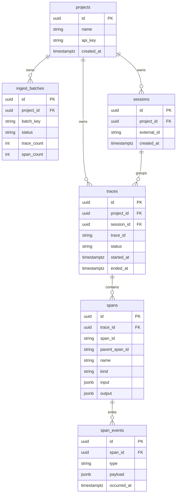

## Persisted entities

### Project

`projects` scope all protected data access. API-key auth resolves a request into a
project before reading or writing anything.

### Ingest batch

`ingest_batches` store durable idempotency and async lifecycle state for `POST /v1/ingest`.

- One batch is identified externally by `batch_key`
- Async acceptance and polling are backed by persisted batch rows
- The active async path uses the true-async batch model

### Ingest batch payload

`ingest_batch_payloads` store compressed request payloads for accepted async batches until
the worker processes and cleans them up.

### Session

`sessions` group related traces. Each row has:

- An internal UUID primary key
- A user-facing `external_id`
- Optional narrative and workflow-facing metadata used by the debugger

### Trace

`traces` represent individual executions within a session or standalone context. Each row
has:

- An internal UUID primary key
- An external `trace_id`
- Aggregate rollup fields: duration, status, cost, token counts, error counts
- Trace-level input/output payload fields

### Span

`spans` represent operations within a trace. Each row has:

- An internal UUID primary key
- An external `span_id`
- An external `parent_span_id` for tree reconstruction
- `kind`, `status`, timing, cost/token fields, model/provider fields, metadata, and
  span-level payloads

### Span event

`span_events` store explicit append-only events such as logs, errors, exceptions, metrics,
and semantic debugger events.

- Explicit events are stored separately from spans
- Trace timelines merge explicit events with synthetic lifecycle events derived from spans
- Session compare currently focuses on semantic event types (`decision`, `effect`, `wait`)

## Identity rules

- `sessions.external_id` is the user-facing session identifier
- `traces.trace_id` is the external trace identifier
- `spans.span_id` and `spans.parent_span_id` are external span identifiers
- Internal UUIDs are the persistence identity used inside the database and server code

## Payload notes

- There is no standalone runtime `payloads` table for trace/span request and response
  bodies
- Trace payloads live on `traces`
- Span payloads live on `spans`
- Accepted async payload blobs live temporarily in `ingest_batch_payloads`
- The timeline API returns explicit `span_events` plus synthetic lifecycle markers
