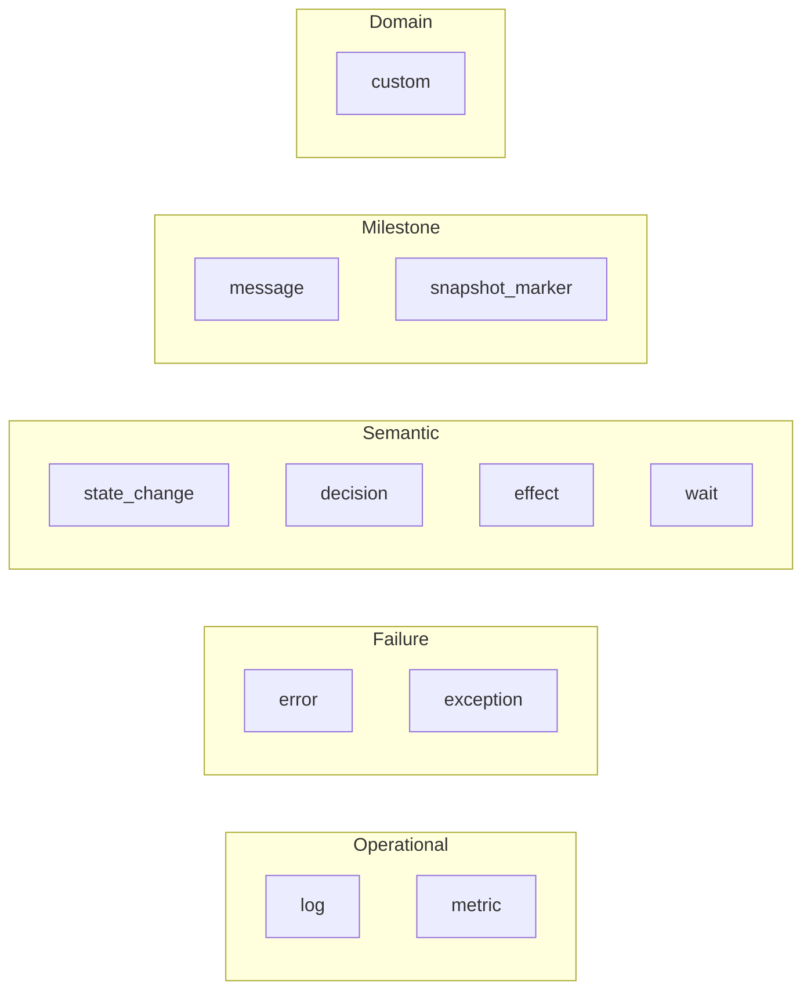

Continua events are **debugger-facing observability signals**. They explain *what
happened* during trace execution. They are not replay primitives, checkpoints, or
durable workflow state machines.



## Choosing an event type

- **`state_change`** — observable state transitions you want shown as `old → new` in the
  debugger.
- **`decision`** — branch points where the system chooses between alternatives.
- **`effect`** — external actions, model invocations, or side effects worth surfacing.
- **`wait`** — progress blocked on a human, external dependency, or timer.
- **`snapshot_marker`** — first-class debugger milestones with a compact label.
- **`message`** — lightweight narrative milestones.
- **`log`**, **`error`**, **`exception`** — operational logging and failures.
- **`metric`** — structured numeric measurements.
- **`custom`** — domain-specific payloads when no semantic type fits.

## Event type reference

| Event type | When to use it | Expected payload fields | Default level |
| --- | --- | --- | --- |
| `log` | Operational log line tied to a span | Any optional structured payload | `info` |
| `error` | Explicit failure signal without exception details | Any optional structured payload | `error` |
| `exception` | Captured exception with structured exception metadata | `exception_type`, `exception_message`, `traceback` | `error` |
| `message` | Lightweight narrative milestone | Optional | `info` |
| `metric` | Numeric measurement attached to a span | `metric_name`, `metric_value`, optional `metric_unit` | `info` |
| `custom` | Domain-specific event that doesn't fit another type | Any optional structured payload | `info` |
| `state_change` | Observable state transition rendered in the State view | `key`, optional `namespace`, optional `old_value`, optional `new_value` | `info` |
| `decision` | Branch point with a selected outcome | `question`, `chosen`, optional `alternatives`, optional `reasoning` | `info` |
| `effect` | External side effect, tool call, or model invocation | `effect_kind`, `has_external_side_effect`, optional `effect_id`, optional `idempotent` | `info` |
| `wait` | Blocked or deferred progress | `wait_kind`, `phase`, optional `wait_id`, optional `resolution` | `info` |
| `snapshot_marker` | Debugger milestone surfaced as a timeline semantic | `marker_kind`, `label` | `info` |

## `state_change`

Recommended payload:

```json
{
  "key": "status",
  "namespace": "order",
  "old_value": "pending",
  "new_value": "approved"
}
```

```python
with span("validate_order") as s:
    s.state_change(
        "status",
        "pending",
        "approved",
        namespace="order",
        message="Order approved after validation",
    )
```

Use `state_change` instead of `custom` when you want the debugger to show a before/after
transition rather than a raw JSON blob.

## `decision`

Recommended payload:

```json
{
  "question": "Which model should handle the request?",
  "chosen": "gpt-4.1",
  "alternatives": ["gpt-4o-mini", "gpt-4.1"],
  "reasoning": "Escalated for higher quality on refund requests"
}
```

```python
with span("route_request") as s:
    s.decision(
        "Which model should handle the request?",
        "gpt-4.1",
        alternatives=["gpt-4o-mini", "gpt-4.1"],
        reasoning="Escalated for higher quality on refund requests",
    )
```

Use `decision` when the key debugging question is *"why did the system choose this path?"*

## `effect`

Use when a span performs work whose observable consequence matters outside the current
call stack: model calls, tool invocations, outbound API calls, or writes to external
systems.

```python
with span("sync_billing") as s:
    s.effect(
        "api_call",
        has_external_side_effect=True,
        effect_id="billing-sync-42",
        payload={"target": "billing"},
    )
```

`set_llm_response()` and `set_tool_call()` emit `effect` events implicitly:

```python
with span("draft_reply", kind="llm") as s:
    s.set_llm_response(
        model="gpt-4.1-mini",
        messages=[{"role": "user", "content": "Summarize this ticket"}],
        response={"role": "assistant", "content": "Summary"},
        tokens_in=120,
        tokens_out=48,
    )
```

## `wait`

Use when execution paused pending some later resolution.

```python
with span("review_order") as s:
    s.wait("human_approval", phase="entered", payload={"reviewer": "ops"})
```

When the wait resolves:

```python
s.wait(
    "human_approval",
    phase="resolved",
    wait_id="approval-42",
    resolution="approved",
)
```

## `snapshot_marker`

Use when execution reached a notable milestone and you want it to stay semantically
distinct from generic logs.

```python
with span("checkout_flow") as s:
    s.snapshot_marker(
        "Inventory reserved",
        marker_kind="phase",
        payload={"reservation_id": "res-42"},
    )
```

`snapshot_marker` is a **debugger milestone event**, not a checkpoint, resume token, or
replay primitive.

## Quick heuristics

- Want `old → new`? → `state_change`
- Want `question → chosen`? → `decision`
- "This span called out to something important"? → `effect`
- "This span had to wait"? → `wait`
- "Execution reached this milestone"? → `snapshot_marker`
- Just a human-readable sentence? → `message`
- Free-form payload, no special UI? → `custom`
