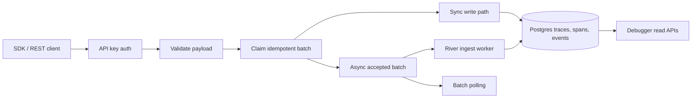

## Three ingest modes

`POST /v1/ingest` accepts the same payload in three modes. The Python SDK exposes this
via `ingest_mode` on `Continua.init(...)`:

| Mode | When to use | Behavior |
| --- | --- | --- |
| `sync` | You need read-after-write: your code reads the data back immediately | Server writes synchronously and returns when persistence is complete |
| `async_v2` | High throughput, fire-and-forget | Server accepts the batch, persists payload + idempotency, returns `202` with a `batch_id`. A River worker processes the batch shortly after. |
| `server_default` | Defer to the server's rollout setting | Honors `INGEST_TRUE_ASYNC_DEFAULT` env var |

```python
Continua.init(
    api_key="...",
    endpoint="http://localhost:8080",
    ingest_mode="async_v2",
)
```

## Idempotency: the `batch_key`

Every ingest request carries a `batch_key`. The server claims a row in `ingest_batches`
keyed by `(project_id, batch_key)`. If the same `batch_key` is replayed, the server
returns the existing batch row instead of duplicating writes.

This means:

- SDK retries are safe: a network blip will not double-ingest.
- You can re-run a backfill script as long as `batch_key` is stable.

The Python SDK generates `batch_key` per flush automatically.

## Polling for completion

True async is **not read-after-write**. If your code needs the batch to be fully processed
before reading the ingested data back, either use `sync` mode or poll:

```python
client = Continua.get_instance()

# Send via async_v2 (returns batch_id)
batch_id = ...

# Poll until terminal
result = client.wait_for_batch(batch_id, timeout=30, poll_interval=0.5)
# result["status"] in {"completed", "failed"}
```

The corresponding REST endpoint is
[`GET /v1/ingest/batches/{id}`](/api-reference).

## Terminal states

| Status | Meaning |
| --- | --- |
| `accepted` | Batch persisted, worker has not yet processed it |
| `processing` | Worker is actively writing traces, spans, events |
| `completed` | All writes succeeded: data is fully readable |
| `failed` | Worker hit a non-retryable error: see batch row for details |

Failed batch payloads are retained for `INGEST_FAILED_PAYLOAD_RETENTION` before cleanup.

## Background workers

Two River workers cooperate on the async path:

- **Ingest batch worker** (`internal/jobs`): reads accepted batches, validates, writes
  traces/spans/events through the shared write path in `internal/ingest/processor.go`.
- **Trace rollup worker**: recomputes trace-level aggregate fields (status, duration,
  cost, token counts) after spans land.
- **Cleanup worker**: deletes processed `ingest_batch_payloads` blobs after retention.

## Choosing a mode

| Scenario | Recommended mode |
| --- | --- |
| Local debugging, scripts, demos | `sync` |
| Production agent emitting high volume | `async_v2` |
| Backfill jobs that must be idempotent and not block | `async_v2` + stable `batch_key` |
| You need to read traces back in the same request | `sync` |
| You can afford a brief delay before traces appear | `async_v2` |
