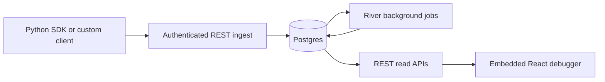

Continua is a single Go server plus an embedded React debugger operator console. The
active request path is:



## Runtime components

### Platform server

The Go server in `cmd/continua` is wired with Fx in `cmd/continua/main.go` and provides:

- Authenticated REST APIs defined in `contracts/openapi/openapi.yaml`
- Ingest handling in `internal/api` and `internal/ingest`
- River worker startup in `internal/jobs`
- Postgres-backed store/query access in `internal/store`
- The embedded web UI from `internal/web`

The HTTP router is Chi-based (`internal/api/router.go`).

### Embedded web UI

The frontend in `web/` is a Vite React SPA built into `internal/web/static/` and embedded
into the Go binary. Implemented surfaces include:

- Shared `AppShell` with primary navigation and route-aware utility chrome
- `/` overview built from existing trace and session list endpoints
- Traces list with URL-driven filtering and return navigation
- Trace detail with failure-first triage, a desktop trace-context drawer, and mobile
  `Summary` / `Execution` / `Timeline` / `State` tabs
- Payload inspection, truncation banners, reasoning/state surfaces, merged polling-based
  timeline
- Sessions list, session detail, session compare workspaces
- Settings, auth recovery, command palette, theming

### Background jobs

River workers run inside the platform server process and currently handle:

- Async ingest batch processing
- Trace rollup computation (status, duration, cost, token counts)
- Failed payload cleanup

### SDKs

| SDK | State |
| --- | --- |
| Python (`sdks/python/`) | **Implemented** and usable in production |
| TypeScript (`sdks/typescript/`) | Stub package only |

## Read path

The debugger does not use a live WebSocket runtime today. It polls the timeline API for
running traces and merges explicit stored events with synthetic lifecycle events derived
from spans.

Implemented read endpoints:

```text
GET /api/traces
GET /api/traces/{id}
GET /api/traces/{id}/spans
GET /api/traces/{id}/events
GET /api/sessions
GET /api/sessions/{id}
```

## Contracts and generation

Source-of-truth files:

- REST: `contracts/openapi/openapi.yaml`
- WebSocket schemas: `contracts/websocket/events.ts`
- SQLC inputs: `db/platform/queries/*.sql`

Run `make generate` after changing any of the above.

## What is not implemented yet

These directories exist as plans or scaffolding, not as runtime capabilities. Treat them
as future-state, not as extension points:

- Durable execution engine in `engine/`
- Live WebSocket runtime in `internal/ws`
- Proxy capture runtime in `internal/proxy`
- Replay execution runtime in `internal/replay`
- Feature-complete TypeScript SDK
