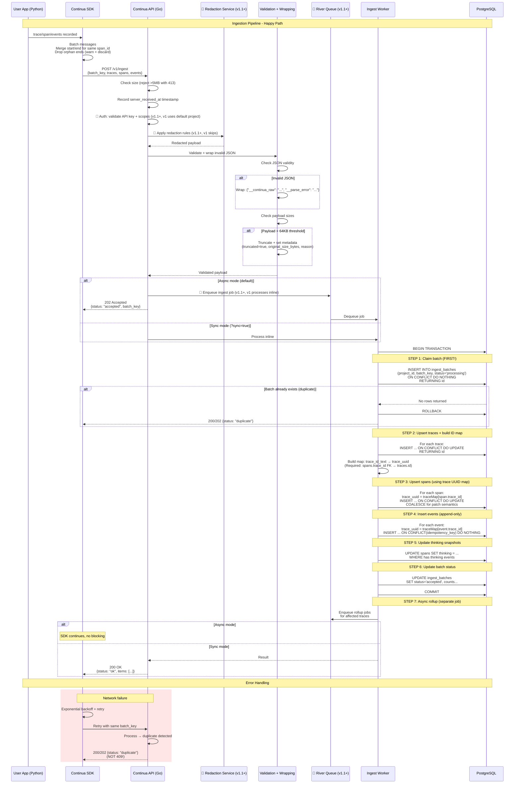
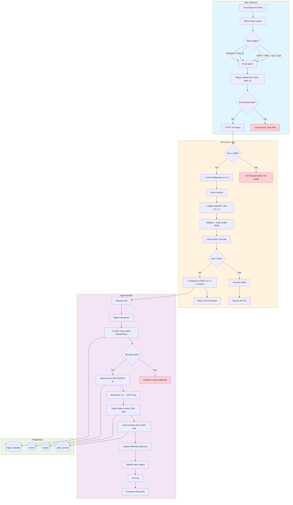
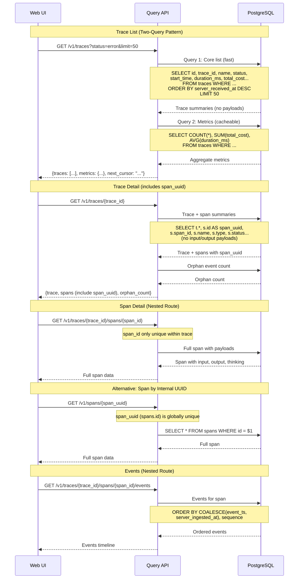
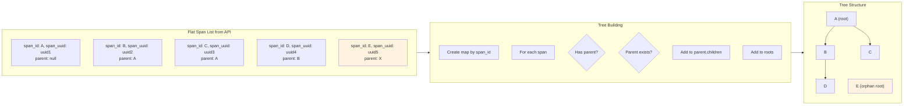
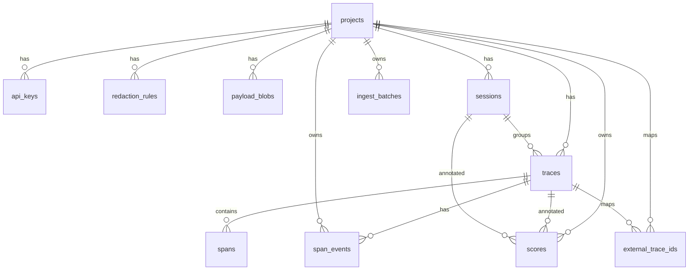

# Continua Ingestion & Query Flows

> **Version Note**: This document describes the complete ingestion architecture.
> - **v1**: Processes inline (no River queue), uses default project (no auth), no redaction
> - **v1.1+**: Adds River queue for async, authentication, and redaction service
>
> Components marked with 🔮 are planned for v1.1+.

## Main Ingestion Pipeline (Corrected)



---

## Detailed Worker Flowchart (Corrected)

> **v1 Note**: In v1, auth middleware uses default project, redaction is skipped, and async mode processes inline (no River queue).



---

## Query Flow (with Corrected Endpoints)



---

## Tree Building (Client-Side)



Note: Span E has parent X which doesn't exist in the list. 
It becomes an "orphan root" - displayed as a root in the tree.
This is a feature, not a bug (indicates incomplete data).

---

## ER Diagram



---

## HTTP Status Code Reference

| Scenario | Status | Response Body |
|----------|--------|---------------|
| Async, new batch | 202 | `{status: "accepted", batch_key: "..."}` |
| Async, duplicate | 202 | `{status: "duplicate", batch_key: "..."}` |
| Sync, success | 200 | `{status: "ok", items: [...]}` |
| Sync, duplicate | 200 | `{status: "duplicate"}` |
| Validation error | 400 | `{error: "...", details: [...]}` |
| Auth failure | 401 | `{error: "invalid API key"}` |
| Missing scope | 403 | `{error: "insufficient permissions"}` |
| Batch too large | 413 | `{error: "batch exceeds 5MB limit"}` |
| Server error | 500 | `{error: "internal error"}` |

**Important:** Duplicates return success (200/202), NOT 409. A duplicate means "already processed successfully".

---

## Key Implementation Notes

### 1. Batch Idempotency Must Be Claimed First

```sql
-- FIRST operation in transaction
INSERT INTO ingest_batches (project_id, batch_key, status)
VALUES ($1, $2, 'processing')
ON CONFLICT (project_id, batch_key) DO NOTHING
RETURNING id;

-- If no rows returned → batch already processed → ROLLBACK immediately
```

### 2. Trace ID Mapping Is Required

```go
// SDK sends external trace_id (TEXT)
// DB uses internal traces.id (UUID)
// spans.trace_id FK → traces.id

traceMap := make(map[string]uuid.UUID)
for _, t := range req.Traces {
    internalID, _ := store.UpsertTrace(ctx, t)
    traceMap[t.TraceID] = internalID
}

// Use internal UUID for spans and events
for _, s := range req.Spans {
    traceUUID := traceMap[s.TraceID]
    store.UpsertSpan(ctx, traceUUID, s)
}
```

### 3. SDK Must Not Create End-Only Spans

```python
def enqueue_span_end(self, trace_id, span_id, **updates):
    key = f"{trace_id}:{span_id}"
    if key in self._spans:
        self._spans[key].merge_end(**updates)
    else:
        # DO NOT create span - required fields missing
        logger.warning(f"Span end without start: {span_id}")
```

### 4. Endpoint Routing for Span Uniqueness

```
# span_id only unique within trace - use nested routes
GET /v1/traces/{trace_id}/spans/{span_id}
GET /v1/traces/{trace_id}/spans/{span_id}/events

# Alternative when internal UUID known
GET /v1/spans/{span_uuid}
```
