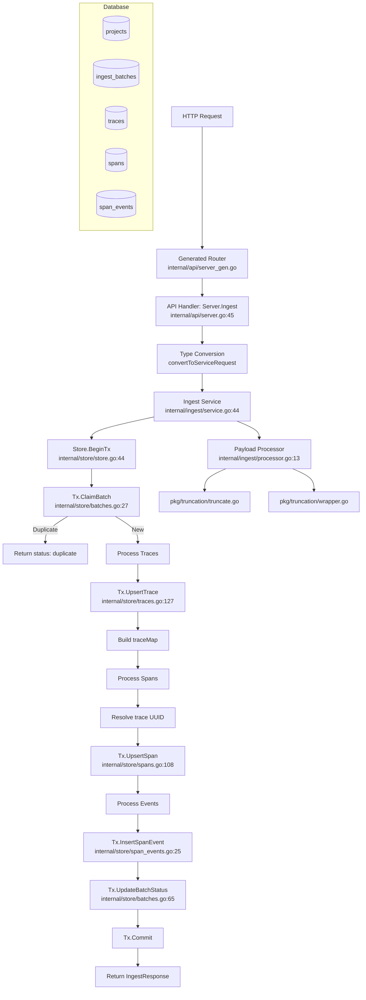

# Continua Ingestion Pipeline - Codebase Guide

This guide documents the batch ingestion pipeline implementation in Continua, covering the complete flow from HTTP request to database writes.

---

## 1) Overview

The ingestion pipeline adds a batch endpoint (`POST /v1/ingest`) that accepts traces, spans, and events from SDKs with:
- **Idempotent processing** via `batch_key` deduplication
- **Upsert semantics** for traces and spans (patch-style updates)
- **Multi-tenant support** via `project_id` on all tables
- **Payload truncation** at 64KB with metadata tracking
- **Invalid JSON wrapping** for non-JSON payloads

The implementation follows an all-or-nothing transaction model where validation errors reject the entire batch.

### Corresponding OpenSpec Documents

| Document | Purpose |
|----------|---------|
| `openspec/implemented/add-ingestion-pipeline/proposal.md` | Why, what, impact summary |
| `openspec/implemented/add-ingestion-pipeline/design.md` | Technical decisions and architecture |
| `openspec/implemented/add-ingestion-pipeline/specs/ingestion/spec.md` | Batch ingestion capability spec |
| `openspec/implemented/add-ingestion-pipeline/specs/idempotency/spec.md` | Batch deduplication spec |
| `openspec/implemented/add-ingestion-pipeline/specs/data-model/spec.md` | Extended schema spec |
| `openspec/implemented/add-ingestion-pipeline/tasks.md` | Implementation checklist |

---

## 2) High-Level Architecture

### Components

| Component | Location | Purpose |
|-----------|----------|---------|
| API Handler | `internal/api/server.go:45-134` | HTTP request handling, size limits, type conversion |
| Ingest Service | `internal/ingest/service.go:19-402` | Transaction orchestration, validation, processing |
| Ingest DTOs | `internal/ingest/dto.go:1-97` | Service-layer request/response types |
| Payload Processor | `internal/ingest/processor.go:1-51` | JSON marshaling, wrapping, truncation |
| Store Layer | `internal/store/*.go` | Database access with transaction support |
| SQLC Queries | `db/platform/queries/*.sql` | SQL definitions for code generation |
| Truncation Utils | `pkg/truncation/truncate.go` | 64KB payload truncation |
| JSON Wrapper | `pkg/truncation/wrapper.go` | Invalid JSON wrapping |
| Domain Types | `internal/domain/*.go` | Domain model definitions (reference only) |

### Dependency Diagram



### Key Design Rules Implemented

1. **Batch claiming is FIRST** - `ClaimBatch` runs before any trace/span/event writes
2. **All-or-nothing validation** - Any validation error rejects the entire batch (v1)
3. **Upsert semantics** - Traces and spans use `ON CONFLICT DO UPDATE` with COALESCE
4. **Metadata shallow merge** - `existing || new` for JSONB metadata fields
5. **Input/output replace** - Payload fields are replaced, not merged
6. **Status protection** - Error/failed status can never be downgraded
7. **Events are append-only** - No upsert, only insert with idempotency via `idempotency_key`

---

## 3) Directory & File Map

### Core Implementation Files

#### API Layer

| File | Purpose | Key Items |
|------|---------|-----------|
| `internal/api/server.go` | HTTP handlers | `Server` struct, `Ingest()` handler, `convertToServiceRequest()`, `MaxBodySize = 5MB` |
| `internal/api/server_gen.go` | Generated OpenAPI code | Router bindings, generated types `IngestRequest`, `IngestResponse`, `IngestParams` |
| `internal/api/mapper.go` | DB-to-API type conversion | `traceToAPI()`, `spanToAPI()`, `sessionToAPI()` |

#### Ingest Service

| File | Purpose | Key Items |
|------|---------|-----------|
| `internal/ingest/service.go` | Core orchestration | `Service.Ingest()` (main entry), `validateBatch()`, `upsertTrace()`, `upsertSpan()`, `insertEvent()`, `ValidationError` |
| `internal/ingest/dto.go` | Service DTOs | `IngestRequest`, `IngestResponse`, `TraceInput`, `SpanInput`, `EventInput`, `IngestStatus` constants |
| `internal/ingest/processor.go` | Payload processing | `processPayload()` - marshals, wraps invalid JSON, truncates |

#### Store Layer

| File | Purpose | Key Items |
|------|---------|-----------|
| `internal/store/store.go` | Store wrapper | `Store` struct, `BeginTx()`, `ErrNotFound`, `ErrDuplicateBatch`, `IsNotFound()` |
| `internal/store/tx.go` | Transaction wrapper | `Tx` struct, `Commit()`, `Rollback()`, `Queries()` |
| `internal/store/batches.go` | Batch operations | `ClaimBatch()`, `UpdateBatchStatus()`, `GetBatch()`, `GetBatchByKey()` |
| `internal/store/traces.go` | Trace operations | `CreateTrace()`, `UpsertTrace()`, `GetTraceUUID()`, `GetTraceByExternalID()` |
| `internal/store/spans.go` | Span operations | `CreateSpan()`, `UpsertSpan()`, `GetSpanByExternalID()` |
| `internal/store/span_events.go` | Event operations | `InsertSpanEvent()`, `ListSpanEventsBySpan()`, `CountOrphanEvents()` |
| `internal/store/projects.go` | Project operations | `GetDefaultProject()` |
| `internal/store/sessions.go` | Session operations | `CreateSession()`, `ListSessions()` |

#### SQL Queries

| File | Purpose | Key Queries |
|------|---------|-------------|
| `db/platform/queries/batches.sql` | Batch SQL | `ClaimBatch`, `UpdateBatchStatus`, `GetBatch`, `ListBatches` |
| `db/platform/queries/traces.sql` | Trace SQL | `UpsertTrace`, `GetTraceUUID`, `CreateTrace`, `ListTraces` |
| `db/platform/queries/spans.sql` | Span SQL | `UpsertSpan`, `CreateSpan`, `GetSpanByExternalID` |
| `db/platform/queries/events.sql` | Event SQL | `InsertSpanEvent`, `ListSpanEventsBySpan`, `CountOrphanEvents` |
| `db/platform/queries/projects.sql` | Project SQL | `GetDefaultProject`, `GetProject` |

#### Utilities

| File | Purpose | Key Items |
|------|---------|-----------|
| `pkg/truncation/truncate.go` | Payload truncation | `TruncateJSON()`, `TruncateWithLimit()`, `DefaultMaxBytes = 64KB`, `TruncateResult` |
| `pkg/truncation/wrapper.go` | Invalid JSON wrapper | `WrapInvalidJSON()`, `EnsureJSON()`, wraps as `{"__continua_raw": "...", "__parse_error": "..."}` |

#### Domain Types (Reference)

| File | Purpose |
|------|---------|
| `internal/domain/trace.go` | `Trace`, `TraceInput`, `TraceStatus` constants |
| `internal/domain/span.go` | `Span`, `SpanInput`, `SpanStatus`, `SpanType`, `SpanLevel` constants |
| `internal/domain/event.go` | `SpanEvent`, `SpanEventInput`, `EventType`, `EventLevel` constants |
| `internal/domain/batch.go` | `Batch`, `BatchResult`, `BatchStatus` constants |

#### Database Schema

| File | Purpose |
|------|---------|
| `db/platform/migrations/postgres/0001_initial_schema.up.sql` | Full schema: `projects`, `sessions`, `traces`, `spans`, `span_events`, `ingest_batches`, `payloads` |
| `db/platform/migrations/postgres/0001_initial_schema.down.sql` | Drop all tables |

#### Generated Code

| File | Source |
|------|--------|
| `db/gen/go/platform/models.go` | sqlc from schema |
| `db/gen/go/platform/batches.sql.go` | sqlc from `batches.sql` |
| `db/gen/go/platform/traces.sql.go` | sqlc from `traces.sql` |
| `db/gen/go/platform/spans.sql.go` | sqlc from `spans.sql` |
| `db/gen/go/platform/events.sql.go` | sqlc from `events.sql` |
| `contracts/generated/go/server_gen.go` | oapi-codegen from `openapi.yaml` |

---

## 4) Request/Response Contract

### Endpoint

```
POST /v1/ingest?sync=<boolean>
Content-Type: application/json
```

### Query Parameters

| Param | Type | Default | Description |
|-------|------|---------|-------------|
| `sync` | boolean | `false` | If true, returns 200 with full result. If false, returns 202 "accepted". |

### Request Body Schema

```json
{
  "batch_key": "string (required)",
  "traces": [
    {
      "trace_id": "string (required)",
      "session_id": "uuid",
      "name": "string",
      "user_id": "string",
      "tags": ["string"],
      "environment": "string",
      "release": "string",
      "metadata": { "any": "json" },
      "input": "any json value",
      "output": "any json value",
      "status": "running|completed|failed (default: running)",
      "start_time": "RFC3339 datetime",
      "end_time": "RFC3339 datetime"
    }
  ],
  "spans": [
    {
      "trace_id": "string (required)",
      "span_id": "string (required)",
      "parent_span_id": "string",
      "name": "string (required)",
      "type": "default|llm|tool|agent|chain|retrieval|embedding|generation",
      "status": "running|completed|failed",
      "status_message": "string",
      "level": "debug|default|warning|error",
      "start_time": "RFC3339 datetime (required)",
      "end_time": "RFC3339 datetime",
      "input": "any json value",
      "output": "any json value",
      "model": "string",
      "provider": "string",
      "prompt_tokens": "int64",
      "completion_tokens": "int64",
      "total_tokens": "int64",
      "total_cost": "float64",
      "metadata": { "any": "json" },
      "sequence": "int32",
      "depth": "int32"
    }
  ],
  "events": [
    {
      "trace_id": "string (required)",
      "span_id": "string (required)",
      "event_type": "log|error|exception|message|metric|custom",
      "level": "debug|info|warning|error",
      "event_ts": "RFC3339 datetime",
      "sequence": "int32",
      "message": "string",
      "payload": { "any": "json" },
      "idempotency_key": "string"
    }
  ]
}
```

### Response Codes

| Code | Condition | Response Shape |
|------|-----------|----------------|
| 200 | Sync success | `{"status": "ok", "batch_key": "...", "trace_count": N, ...}` |
| 200 | Sync duplicate | `{"status": "duplicate", "batch_key": "..."}` |
| 202 | Async accepted | `{"status": "accepted", "batch_key": "..."}` |
| 202 | Async duplicate | `{"status": "duplicate", "batch_key": "..."}` |
| 400 | Validation error | `{"code": "validation_error", "message": "..."}` |
| 400 | Invalid JSON | `{"code": "invalid_json", "message": "..."}` |
| 413 | Body > 5MB | `{"error": "batch exceeds 5MB limit"}` |
| 500 | Internal error | `{"code": "internal_error", "message": "..."}` |

### Size Limits

- **Request body**: 5MB (`internal/api/server.go:16`)
- **Individual payloads** (input/output/payload): 64KB (`pkg/truncation/truncate.go:8`)

### Validation Behavior (v1)

Per spec, the entire batch is rejected on any validation error:
- Missing `batch_key` → 400
- Trace missing `trace_id` → 400
- Span missing `trace_id`, `span_id`, `name`, or `start_time` → 400
- Event missing `trace_id` or `span_id` → 400
- Span/event referencing unknown `trace_id` (not in batch and not in DB) → 400

---

## 5) End-to-End Code Flow (Sync Ingest)

### Step-by-Step Flow

#### Step 1: HTTP Handler Receives Request
**File**: `internal/api/server.go:45-134`
**Function**: `Server.Ingest()`

```go
func (s *Server) Ingest(w http.ResponseWriter, r *http.Request, params IngestParams) {
    // 1a. Check Content-Length for 413 before reading body
    if r.ContentLength > MaxBodySize {
        write413Error(w, "batch exceeds 5MB limit")
        return
    }

    // 1b. Limit reader to prevent DoS
    r.Body = http.MaxBytesReader(w, r.Body, MaxBodySize)

    // 1c. Parse JSON request body
    var req IngestRequest
    if err := json.NewDecoder(r.Body).Decode(&req); err != nil {
        // Check for MaxBytesError (body exceeded limit during read)
        if isMaxBytesError(err) {
            write413Error(w, "batch exceeds 5MB limit")
            return
        }
        writeError(w, http.StatusBadRequest, "invalid_json", "...")
        return
    }

    // 1d. Get default project (v1 single-tenant)
    project, err := s.store.GetDefaultProject(r.Context())

    // 1e. Convert API types to service types
    svcReq := convertToServiceRequest(req)

    // 1f. Call ingest service
    result, err := s.ingestService.Ingest(r.Context(), project.ID, &svcReq)
}
```

#### Step 2: Service Begins Transaction
**File**: `internal/ingest/service.go:55-60`
**Function**: `Service.Ingest()`

```go
func (s *Service) Ingest(ctx context.Context, projectID uuid.UUID, req *IngestRequest) (*IngestResponse, error) {
    // 2a. Validate batch_key is present
    if req.BatchKey == "" {
        return nil, &ValidationError{Errors: []string{"batch_key is required"}}
    }

    // 2b. Validate entire batch upfront (Phase 1)
    validationErrors := s.validateBatch(req)
    if len(validationErrors) > 0 {
        return nil, &ValidationError{Errors: validationErrors}
    }

    // 2c. Start transaction
    tx, err := s.store.BeginTx(ctx, pgx.TxOptions{})
    defer func() { _ = tx.Rollback(ctx) }()
}
```

#### Step 3: Claim Batch (FIRST DB Operation)
**File**: `internal/ingest/service.go:62-73`
**SQL**: `db/platform/queries/batches.sql:1-7`

```go
// 3. Claim the batch (idempotency check) - FIRST operation in transaction
batchID, err := tx.ClaimBatch(ctx, projectID, req.BatchKey)
if errors.Is(err, store.ErrDuplicateBatch) {
    // Duplicate batch - return success without processing
    return &IngestResponse{
        Status:   string(IngestStatusDuplicate),
        BatchKey: req.BatchKey,
    }, nil
}
```

**SQL executed**:
```sql
INSERT INTO ingest_batches (project_id, batch_key, status)
VALUES ($1, $2, 'processing')
ON CONFLICT (project_id, batch_key) DO NOTHING
RETURNING id;
```

#### Step 4: Process Traces (Build ID Map)
**File**: `internal/ingest/service.go:79-88`
**Function**: `Service.upsertTrace()`

```go
// 4. Build trace map: external trace_id -> internal UUID
traceMap := make(map[string]uuid.UUID)

for i := range req.Traces {
    trace := &req.Traces[i]
    internalID, err := s.upsertTrace(ctx, tx, projectID, trace)
    if err != nil {
        return nil, fmt.Errorf("failed to upsert trace %s: %w", trace.TraceID, err)
    }
    traceMap[trace.TraceID] = internalID
}
```

**Inside `upsertTrace()`** (`internal/ingest/service.go:234-286`):
- Marshals metadata to JSON
- Calls `processPayload()` for input/output (wrapping + truncation)
- Converts times to `pgtype.Timestamptz`
- Calls `tx.UpsertTrace()` with all parameters

#### Step 5: Process Spans (Resolve Trace UUIDs)
**File**: `internal/ingest/service.go:90-112`
**Function**: `Service.upsertSpan()`

```go
for i := range req.Spans {
    span := &req.Spans[i]

    // 5a. Resolve trace UUID from map or DB
    traceUUID, ok := traceMap[span.TraceID]
    if !ok {
        // Try to find existing trace in DB
        traceUUID, err = tx.GetTraceUUID(ctx, projectID, span.TraceID)
        if err != nil {
            if store.IsNotFound(err) {
                // Unknown trace reference -> ValidationError
                return nil, &ValidationError{Errors: []string{
                    fmt.Sprintf("span %s references unknown trace %s", span.SpanID, span.TraceID),
                }}
            }
            return nil, fmt.Errorf("failed to lookup trace for span %s: %w", span.SpanID, err)
        }
        traceMap[span.TraceID] = traceUUID
    }

    // 5b. Upsert the span
    if err := s.upsertSpan(ctx, tx, projectID, traceUUID, span); err != nil {
        return nil, fmt.Errorf("failed to upsert span %s: %w", span.SpanID, err)
    }
}
```

#### Step 6: Process Events (Append-Only with Idempotency)
**File**: `internal/ingest/service.go:114-140`
**Function**: `Service.insertEvent()`

```go
actualEventInserts := int32(0)
for i := range req.Events {
    event := &req.Events[i]

    // 6a. Resolve trace UUID (same pattern as spans)
    traceUUID, ok := traceMap[event.TraceID]
    if !ok {
        traceUUID, err = tx.GetTraceUUID(ctx, projectID, event.TraceID)
        if err != nil {
            if store.IsNotFound(err) {
                return nil, &ValidationError{Errors: []string{
                    fmt.Sprintf("event for span %s references unknown trace %s", event.SpanID, event.TraceID),
                }}
            }
            return nil, fmt.Errorf("failed to lookup trace for event: %w", err)
        }
        traceMap[event.TraceID] = traceUUID
    }

    // 6b. Insert event (returns false if duplicate via idempotency_key)
    inserted, err := s.insertEvent(ctx, tx, projectID, traceUUID, event)
    if err != nil {
        return nil, fmt.Errorf("failed to insert event for span %s: %w", event.SpanID, err)
    }
    if inserted {
        actualEventInserts++
    }
}
```

**Note**: `event_count` in the response reflects actual inserts, not submitted count. Duplicate events (via `idempotency_key`) are silently ignored.

#### Step 7: Update Batch Status
**File**: `internal/ingest/service.go:142-163`

```go
traceCount := int32(len(req.Traces))
spanCount := int32(len(req.Spans))
eventCount := actualEventInserts  // actual inserts, not len(req.Events)
acceptedCount := traceCount + spanCount + actualEventInserts
rejectedCount := int32(0)  // Duplicate events are NOT counted as rejected

err = tx.UpdateBatchStatus(ctx, platform.UpdateBatchStatusParams{
    ID:            batchID,
    Status:        "accepted",  // Spec: use "accepted" not "completed"
    TraceCount:    &traceCount,
    SpanCount:     &spanCount,
    EventCount:    &eventCount,
    AcceptedCount: &acceptedCount,
    RejectedCount: &rejectedCount,
})
```

#### Step 8: Commit Transaction
**File**: `internal/ingest/service.go:165-178`

```go
if err := tx.Commit(ctx); err != nil {
    return nil, fmt.Errorf("failed to commit transaction: %w", err)
}

return &IngestResponse{
    Status:        string(IngestStatusOK),
    BatchKey:      req.BatchKey,
    TraceCount:    traceCount,
    SpanCount:     spanCount,
    EventCount:    eventCount,
    AcceptedCount: acceptedCount,
    RejectedCount: rejectedCount,
}, nil
```

---

## 6) Data Model Mapping

### External to Internal ID Mapping

| External ID | Internal ID | Lookup |
|-------------|-------------|--------|
| `trace_id` (TEXT) | `traces.id` (UUID) | `GetTraceUUID(project_id, trace_id)` |
| `span_id` (TEXT) | `spans.id` (UUID) | `GetSpanByExternalID(trace_uuid, span_id)` |

**Flow**:
1. SDK sends `trace_id: "my-trace-123"`
2. `UpsertTrace` creates/updates and returns internal UUID
3. Service stores mapping: `traceMap["my-trace-123"] = <uuid>`
4. Spans use the internal UUID for `spans.trace_id` FK

### Span Parent Relationships

- `spans.parent_span_id` is **TEXT** (external ID), not a UUID FK
- No foreign key constraint to `spans` table
- Allows out-of-order ingestion (child before parent)
- UI resolves parent relationships by matching `parent_span_id` to sibling `span_id` values

### Event Relationships

- `span_events.span_id` is **TEXT** (external ID), no FK
- `span_events.trace_id` is **UUID** FK to `traces.id`
- Events can arrive before their parent span exists ("orphan events")
- Query `CountOrphanEvents` / `ListOrphanEvents` to find orphans

### Multi-Tenancy Scope

All data tables have `project_id UUID NOT NULL REFERENCES projects(id)`:
- `projects` - tenant isolation
- `sessions` - FK to projects
- `traces` - FK to projects + UNIQUE(project_id, trace_id)
- `spans` - FK to projects + UNIQUE(trace_id, span_id)
- `span_events` - FK to projects + partial unique on idempotency_key
- `ingest_batches` - FK to projects + UNIQUE(project_id, batch_key)

**v1 Default**: A default project (`00000000-0000-0000-0000-000000000001`) is seeded in the migration for single-tenant mode.

---

## 7) Database Write Walkthrough (with SQL)

### Table: `ingest_batches`

**When written**: First operation in transaction (claim) + final status update

**Claim Pattern** (`db/platform/queries/batches.sql:1-7`):
```sql
-- name: ClaimBatch :one
INSERT INTO ingest_batches (project_id, batch_key, status)
VALUES ($1, $2, 'processing')
ON CONFLICT (project_id, batch_key) DO NOTHING
RETURNING id;
```

- Returns ID if new batch
- Returns no rows (pgx.ErrNoRows) if duplicate
- Store layer converts ErrNoRows to `ErrDuplicateBatch`

**Status Update** (`db/platform/queries/batches.sql:15-24`):
```sql
-- name: UpdateBatchStatus :exec
UPDATE ingest_batches
SET status = $2,
    processing_completed_at = NOW(),
    trace_count = $3,
    span_count = $4,
    event_count = $5,
    accepted_count = $6,
    rejected_count = $7
WHERE id = $1;
```

### Table: `traces`

**When written**: During trace processing loop

**Upsert Pattern** (`db/platform/queries/traces.sql:33-64`):
```sql
-- name: UpsertTrace :one
INSERT INTO traces (
    project_id, session_id, trace_id, name, user_id, tags,
    environment, release, metadata, input, output,
    status, start_time, end_time
)
VALUES ($1, $2, $3, $4, $5, $6, $7, $8, $9, $10, $11, $12, $13, $14)
ON CONFLICT (project_id, trace_id) DO UPDATE SET
    session_id = COALESCE(EXCLUDED.session_id, traces.session_id),
    name = COALESCE(EXCLUDED.name, traces.name),
    user_id = COALESCE(EXCLUDED.user_id, traces.user_id),
    tags = CASE WHEN EXCLUDED.tags IS NOT NULL AND array_length(EXCLUDED.tags, 1) > 0
           THEN EXCLUDED.tags ELSE traces.tags END,
    environment = COALESCE(EXCLUDED.environment, traces.environment),
    release = COALESCE(EXCLUDED.release, traces.release),
    metadata = CASE
        WHEN EXCLUDED.metadata IS NOT NULL THEN traces.metadata || EXCLUDED.metadata
        ELSE traces.metadata
    END,
    input = COALESCE(EXCLUDED.input, traces.input),
    output = COALESCE(EXCLUDED.output, traces.output),
    -- Status protection: never downgrade from failed/error
    status = CASE
        WHEN traces.status IN ('failed', 'error') THEN traces.status
        ELSE COALESCE(EXCLUDED.status, traces.status)
    END,
    start_time = COALESCE(EXCLUDED.start_time, traces.start_time),
    end_time = COALESCE(EXCLUDED.end_time, traces.end_time),
    updated_at = NOW(),
    version = traces.version + 1
RETURNING *;
```

**Key behaviors**:
- NULL values don't overwrite existing (COALESCE)
- `metadata` uses shallow merge (`existing || new`)
- `tags` replaced only if non-empty array provided
- Status can only escalate (running → completed/failed), never downgrade from error

### Table: `spans`

**When written**: During span processing loop

**Upsert Pattern** (`db/platform/queries/spans.sql:42-101`):
```sql
-- name: UpsertSpan :one
INSERT INTO spans (...)
VALUES (...)
ON CONFLICT (trace_id, span_id) DO UPDATE SET
    parent_span_id = COALESCE(EXCLUDED.parent_span_id, spans.parent_span_id),
    name = COALESCE(EXCLUDED.name, spans.name),
    -- Status protection: never downgrade from failed/error
    status = CASE
        WHEN spans.status IN ('failed', 'error') THEN spans.status
        ELSE COALESCE(EXCLUDED.status, spans.status)
    END,
    -- ... other fields with COALESCE ...
    metadata = CASE
        WHEN EXCLUDED.metadata IS NOT NULL THEN spans.metadata || EXCLUDED.metadata
        ELSE spans.metadata
    END,
    duration_ms = CASE
        WHEN EXCLUDED.end_time IS NOT NULL AND spans.start_time IS NOT NULL
        THEN EXTRACT(EPOCH FROM (EXCLUDED.end_time - spans.start_time)) * 1000
        ELSE spans.duration_ms
    END,
    updated_at = NOW(),
    version = spans.version + 1
RETURNING *;
```

**Key behaviors**:
- Same COALESCE pattern as traces
- `duration_ms` auto-calculated when `end_time` provided
- Truncation metadata stored: `input_truncated`, `input_original_size_bytes`, `input_truncation_reason`

### Table: `span_events`

**When written**: During event processing loop (append-only)

**Insert Pattern** (`db/platform/queries/events.sql:1-11`):
```sql
-- name: InsertSpanEvent :one
INSERT INTO span_events (
    project_id, trace_id, span_id, event_type, level,
    event_ts, sequence, message, payload,
    truncated, original_size_bytes, truncation_reason,
    idempotency_key
)
VALUES ($1, $2, $3, $4, $5, $6, $7, $8, $9, $10, $11, $12, $13)
ON CONFLICT (project_id, idempotency_key) WHERE idempotency_key IS NOT NULL
DO NOTHING
RETURNING id;
```

**Key behaviors**:
- Append-only (no UPDATE on conflict)
- Partial unique index only for non-NULL `idempotency_key`
- Returns `uuid.Nil` for duplicates (store layer checks for ErrNoRows)
- Events without `idempotency_key` always insert

---

## 8) Worked Example (Detailed)

### Example Payload

```json
{
  "batch_key": "batch-001",
  "traces": [
    {
      "trace_id": "trace-001",
      "name": "Checkout Flow",
      "status": "running",
      "start_time": "2025-01-01T00:00:00Z",
      "input": { "cart_id": "cart-123" }
    }
  ],
  "spans": [
    {
      "trace_id": "trace-001",
      "span_id": "span-001",
      "name": "Validate Cart",
      "type": "tool",
      "start_time": "2025-01-01T00:00:01Z"
    },
    {
      "trace_id": "trace-001",
      "span_id": "span-002",
      "parent_span_id": "span-001",
      "name": "LLM Decision",
      "type": "llm",
      "model": "gpt-4",
      "start_time": "2025-01-01T00:00:02Z"
    }
  ],
  "events": [
    {
      "trace_id": "trace-001",
      "span_id": "span-001",
      "event_type": "log",
      "message": "Cart validated"
    },
    {
      "trace_id": "trace-001",
      "span_id": "span-002",
      "event_type": "message",
      "idempotency_key": "evt-llm-001",
      "payload": { "role": "assistant", "content": "Processing..." }
    },
    {
      "trace_id": "trace-001",
      "span_id": "span-002",
      "event_type": "error",
      "level": "error",
      "message": "Token limit exceeded"
    }
  ]
}
```

### Function Call Order

| # | Function | File:Line | Action |
|---|----------|-----------|--------|
| 1 | `Server.Ingest()` | `internal/api/server.go:45` | Parse JSON, check size |
| 2 | `convertToServiceRequest()` | `internal/api/server.go:297` | Convert API types to service DTOs |
| 3 | `store.GetDefaultProject()` | `internal/store/projects.go:31` | Get project UUID |
| 4 | `Service.Ingest()` | `internal/ingest/service.go:44` | Entry point |
| 5 | `validateBatch()` | `internal/ingest/service.go:184` | Upfront validation |
| 6 | `store.BeginTx()` | `internal/store/store.go:44` | Start transaction |
| 7 | `tx.ClaimBatch()` | `internal/store/batches.go:27` | Claim batch idempotency |
| 8 | `upsertTrace()` | `internal/ingest/service.go:234` | Process trace-001 |
| 9 | `processPayload()` | `internal/ingest/processor.go:13` | Marshal + truncate input |
| 10 | `tx.UpsertTrace()` | `internal/store/traces.go:127` | Insert/update trace |
| 11 | `upsertSpan()` x2 | `internal/ingest/service.go:288` | Process span-001, span-002 |
| 12 | `tx.UpsertSpan()` x2 | `internal/store/spans.go:108` | Insert/update spans |
| 13 | `insertEvent()` x3 | `internal/ingest/service.go:356` | Process all events |
| 14 | `tx.InsertSpanEvent()` x3 | `internal/store/span_events.go:25` | Insert events |
| 15 | `tx.UpdateBatchStatus()` | `internal/store/batches.go:65` | Update counts |
| 16 | `tx.Commit()` | `internal/store/tx.go:23` | Commit transaction |

### Database State After Success

**ingest_batches**:
| id | project_id | batch_key | status | trace_count | span_count | event_count |
|----|------------|-----------|--------|-------------|------------|-------------|
| b-uuid | 00000000-...-000001 | batch-001 | accepted | 1 | 2 | 3 |

**traces**:
| id | trace_id | name | status | input |
|----|----------|------|--------|-------|
| t-uuid | trace-001 | Checkout Flow | running | {"cart_id":"cart-123"} |

**spans**:
| id | trace_id | span_id | parent_span_id | name | type | model |
|----|----------|---------|----------------|------|------|-------|
| s1-uuid | t-uuid | span-001 | NULL | Validate Cart | tool | NULL |
| s2-uuid | t-uuid | span-002 | span-001 | LLM Decision | llm | gpt-4 |

**span_events**:
| id | trace_id | span_id | event_type | message | idempotency_key |
|----|----------|---------|------------|---------|-----------------|
| e1-uuid | t-uuid | span-001 | log | Cart validated | NULL |
| e2-uuid | t-uuid | span-002 | message | NULL | evt-llm-001 |
| e3-uuid | t-uuid | span-002 | error | Token limit exceeded | NULL |

### Duplicate Batch Behavior

When the same `batch-001` is submitted again:

1. `ClaimBatch` executes `INSERT ... ON CONFLICT DO NOTHING`
2. No rows returned (conflict detected)
3. Store returns `ErrDuplicateBatch`
4. Service returns immediately with:
```json
{
  "status": "duplicate",
  "batch_key": "batch-001"
}
```
5. **No database changes** - transaction rolled back

### Invalid JSON Handling

If a client sends `"input": "{malformed json"`:

1. `processPayload()` receives the string value
2. `json.Marshal()` produces a valid JSON string: `"\"{malformed json\""`
3. `truncation.EnsureJSON()` validates it's valid JSON
4. No wrapping occurs - stored as-is

If raw bytes are truly invalid JSON:

1. `WrapInvalidJSON()` wraps as:
```json
{
  "__continua_raw": "<original bytes>",
  "__parse_error": "<json unmarshal error>"
}
```

---

## 9) Testing Guide

### Running Tests

```bash
# All tests (Go + JS)
make test

# Go tests with race detector
make test-go

# Integration tests (requires running DB)
make test-integration

# Just linting
make lint
make lint-go

# Full CI pipeline locally
make ci
```

### Test Files

| File | Coverage |
|------|----------|
| `internal/ingest/ingest_test.go` | DTO validation, type conversion, placeholder integration |
| `pkg/truncation/truncate_test.go` | JSON truncation with various payloads |
| `pkg/truncation/wrapper_test.go` | Invalid JSON wrapping |

### What Tests Exist

**Unit tests** (`internal/ingest/ingest_test.go`):
- `TestIngestRequest_Validation` - batch_key, trace_id, span_id required
- `TestIngestDTO_Conversion` - field mapping
- `TestBatchKeyGeneration` - UUID/custom formats

**Truncation tests** (`pkg/truncation/truncate_test.go`):
- Under-limit passthrough
- Over-limit truncation
- Object/array structure preservation
- UTF-8 boundary handling

**Wrapper tests** (`pkg/truncation/wrapper_test.go`):
- Valid JSON passthrough
- Invalid JSON wrapping with error message

### Test Gaps

The following are not covered by existing tests:

- **Full integration tests with DB** - placeholder exists but not implemented
- **API handler tests** - no HTTP-level tests for `/v1/ingest`
- **Batch idempotency** - no tests for duplicate batch handling
- **Trace/span upsert semantics** - no tests for COALESCE/merge behavior
- **Event idempotency** - no tests for `idempotency_key` deduplication
- **Unknown trace reference** - no tests for 400 error on missing trace
- **413 size limit** - no tests for large request rejection

---

## 10) Troubleshooting & Common Pitfalls

### Common Errors

| Error | Cause | Response |
|-------|-------|----------|
| `batch_key is required` | Empty or missing `batch_key` | 400 |
| `trace missing required field: trace_id` | Trace without `trace_id` | 400 |
| `span[N] missing required field: X` | Span without trace_id/span_id/name/start_time | 400 |
| `event[N] missing required field: X` | Event without trace_id/span_id | 400 |
| `span X references unknown trace Y` | Span's trace_id not in batch or DB | 400 |
| `event for span X references unknown trace Y` | Event's trace_id not in batch or DB | 400 |
| `batch exceeds 5MB limit` | Request body > 5MB | 413 |
| `Failed to parse request body` | Invalid JSON | 400 |

### Debugging Queries

**Check batch status**:
```sql
SELECT id, batch_key, status, trace_count, span_count, event_count,
       server_received_at, processing_completed_at
FROM ingest_batches
WHERE batch_key = 'batch-001';
```

**Resolve external to internal trace ID**:
```sql
SELECT id, trace_id, name, status
FROM traces
WHERE project_id = '00000000-0000-0000-0000-000000000001'
  AND trace_id = 'trace-001';
```

**View spans for a trace**:
```sql
SELECT span_id, parent_span_id, name, type, status, start_time
FROM spans
WHERE trace_id = '<trace-uuid>'
ORDER BY start_time;
```

**View events for a span**:
```sql
SELECT event_type, level, message, idempotency_key, event_ts
FROM span_events
WHERE trace_id = '<trace-uuid>'
  AND span_id = 'span-001'
ORDER BY COALESCE(event_ts, server_ingested_at);
```

**Find orphan events** (events whose span doesn't exist):
```sql
SELECT e.span_id, COUNT(*) as orphan_count
FROM span_events e
LEFT JOIN spans s ON s.trace_id = e.trace_id AND s.span_id = e.span_id
WHERE e.trace_id = '<trace-uuid>'
  AND s.id IS NULL
GROUP BY e.span_id;
```

**Check for truncated payloads**:
```sql
SELECT span_id, input_truncated, input_original_size_bytes, input_truncation_reason
FROM spans
WHERE trace_id = '<trace-uuid>'
  AND input_truncated = true;
```

### Operational Notes

- **No logging in handler/service** - Debug via DB inspection or returned errors
- **Transaction isolation** - All writes in single transaction, rollback on any error
- **Idempotency is project-scoped** - Same batch_key can exist in different projects
- **Status protection** - Once a trace/span is "failed"/"error", status cannot be downgraded
- **Metadata merge** - Shallow merge only, nested objects fully replaced

---

## Appendix: Quick Reference

### File → Function Mapping

```
POST /v1/ingest
  → internal/api/server_gen.go (generated router)
  → internal/api/server.go:45 Server.Ingest()
  → internal/api/server.go:297 convertToServiceRequest()
  → internal/ingest/service.go:44 Service.Ingest()
    → internal/ingest/service.go:184 validateBatch()
    → internal/store/store.go:44 BeginTx()
    → internal/store/batches.go:27 ClaimBatch()
    → internal/ingest/service.go:234 upsertTrace()
      → internal/ingest/processor.go:13 processPayload()
      → internal/store/traces.go:127 UpsertTrace()
    → internal/ingest/service.go:288 upsertSpan()
      → internal/store/traces.go:70 GetTraceUUID()
      → internal/store/spans.go:108 UpsertSpan()
    → internal/ingest/service.go:356 insertEvent()
      → internal/store/span_events.go:25 InsertSpanEvent()
    → internal/store/batches.go:65 UpdateBatchStatus()
    → internal/store/tx.go:23 Commit()
```

### Response Status Mapping

| Service Status | HTTP Code | Mode |
|----------------|-----------|------|
| `ok` | 200 | sync |
| `duplicate` | 200 | sync |
| `accepted` | 202 | async |
| `duplicate` | 202 | async |
| ValidationError | 400 | any |
| Internal error | 500 | any |
